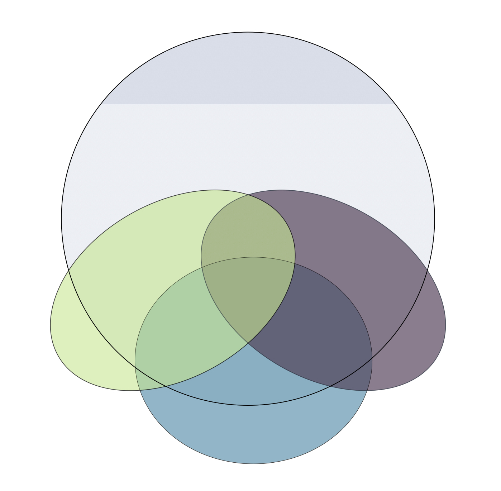
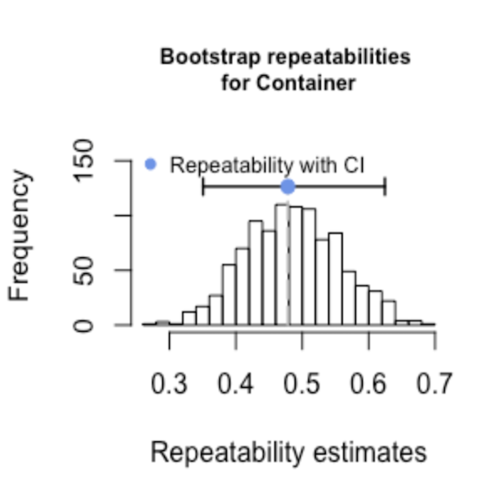
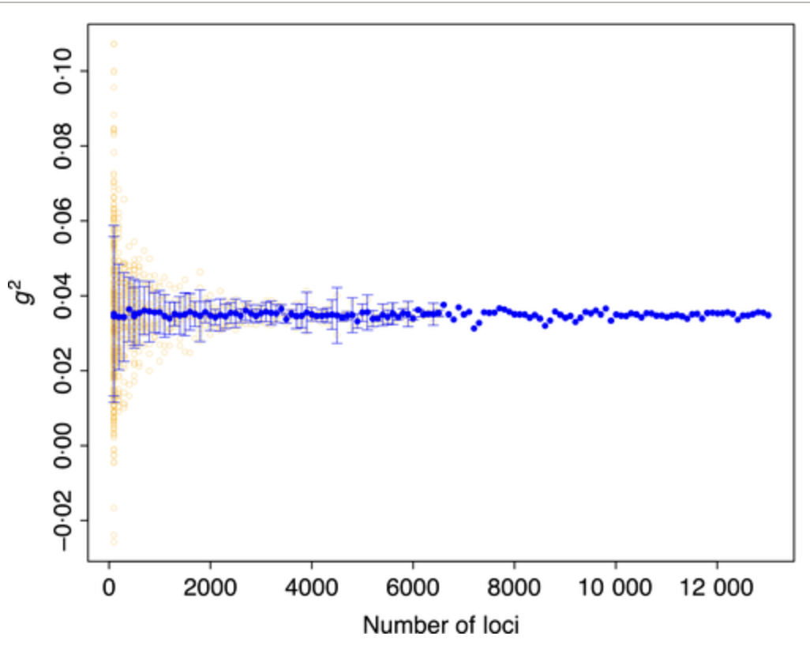
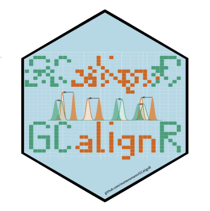
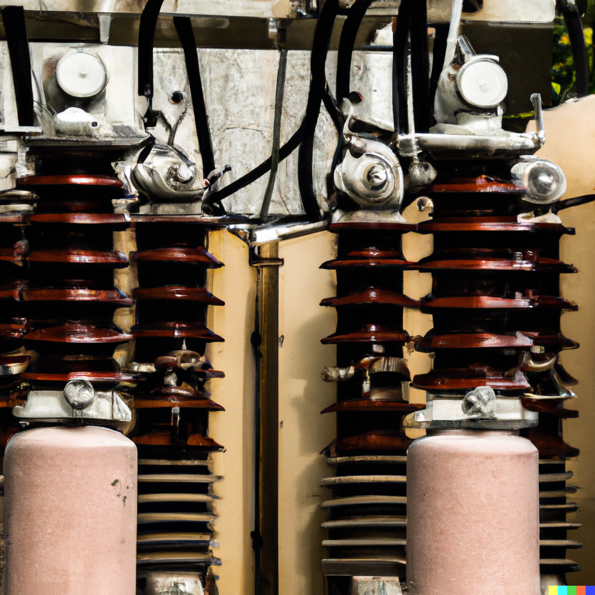

## Scientific software

::: {layout="[15,85]"}

`partR2`: partitioning R^2^ in mixed models.\
[:In a nutshell](#x-partR2), [paper](https://peerj.com/articles/11414/), [package](https://github.com/mastoffel/partR2) |  
:::

::: {layout="[15,85]"}

`rptR`: repeatability estimation and variance decomposition in mixed models.\
[:In a nutshell](#x-rptR),
[paper](https://besjournals.onlinelibrary.wiley.com/doi/abs/10.1111/2041-210X.12797), [package](https://github.com/mastoffel/rptR) | 
:::

::: {layout="[15,85]"}

`inbreedR`: analysing inbreeding with sparse genetic markers.\
[:In a nutshell](#x-inbreedR),
[paper](https://besjournals.onlinelibrary.wiley.com/doi/abs/10.1111/2041-210X.12588), [package](https://github.com/mastoffel/inbreedR) |  
:::

::: {layout="[15,85]"}

`GCalignR`:aligning gas-chromatography data from messy field samples.\
[:In a nutshell](#x-GCalignR),
[paper](https://journals.plos.org/plosone/article?id=10.1371/journal.pone.0198311), [package](https://github.com/mottensmann/GCalignR) |  
:::

## :x partR2 {#x-partr2}

When using a [:mixed model](https://en.wikipedia.org/wiki/Mixed_model), we might ask the question: How much variance does predictor X explain? For several reasons, this has been a rather unsolved problem.´partR2´ implements *one* possible solution to estimate the semi-partial R^2^ in mixed models for single predictors and combinations of predictors. Yes, even interactions, though this is a bit tricky (see the [manual](https://cran.r-project.org/web/packages/partR2/vignettes/Using_partR2.html)). `partR2` really complements `rptR` in that both together make it possible to get a sense of where the variance goes in your model.

*Authors* \| **MA Stoffel**, S Nakagawa, H Schielzeth

## :x rptR {#x-rptR}

The repeatability is also called the [:intra-class coefficient](https://en.wikipedia.org/wiki/Intraclass_correlation#:~:text=In%20statistics%2C%20the%20intraclass%20correlation,same%20group%20resemble%20each%20other.). In hierarchical data, we can measure the impact of group differences on a response variable using the repeatability. Using mixed models, the repeatability is simply the variation explained by a random (group-level) effect. `rptR` has a few tricks up the sleeve to estimate repeatability, confidence intervals and p-values for the most common model types and error distributions.

*Authors* \| **MA Stoffel**, S Nakagawa, H Schielzeth

## :x inbreedR {#x-inbreedR}

Sometimes, one just doesn't have enough genetic markers to be sure about the measured inbreeding coefficients (i.e. when using microsatellites). `inbreedR` implements functions to estimate variance in inbreeding which gives some insights into whether the correlation between heterozygosity and fitness is actually due to (genome-wide) inbreeding or not.

*Authors* \| **MA Stoffel**, M Esser, M Kardos, E Humble, H Nichols, P David, JI Hoffman

## :x GCalignR {#x-GCalignR}

Gas-chromatography samples from the field can be messy. They'll have different concentrations, and lots of dirt in them. However, we usually want to know whether the same peak in each sample corresponds to the same substance. To do this, we need to align all samples. `GCalignR` provides a simple, rule based algorithm which requires a bit of manual input but then works well for a wide range of samples.

*Authors* \| M Ottensmann, **MA Stoffel**, HJ Nichols, JI Hoffman\
\* MO and MAS are shared first authors

## Machine learning

::: {layout="[15,85]"}

A (european) garden bird classifier.  
[app](birds.qmd), [code](https://github.com/mastoffel/birds)
:::

::: {layout="[15,85]"}

  

A neural [:vocoder](https://en.wikipedia.org/wiki/Vocoder) to reconstruct a waveform from a spectrogram, trained on cat meows.  
[code](https://github.com/mastoffel/neural_vocoder/blob/main/neural_vocoder.ipynb)
:::

*Upcoming:*

::: {layout="[15,85]"}

A Transformer built from scratch.
:::

