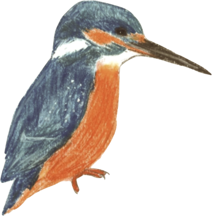

## machine learning

::: {layout="[15,85]"}

  

A [neural vocoder](https://github.com/mastoffel/neural_vocoder/blob/main/neural_vocoder.ipynb) to reconstruct a waveform from a spectrogram, trained on cat meows.
:::

::: {layout="[15,85]"}

A simple [Kingfisher classifier](https://github.com/mastoffel/kingfisher_classifier/blob/main/kingfisher_cnn.ipynb).
:::

::: {layout="[15,85]"}

A [Transformer](https://colab.research.google.com/drive/1-Xjhro3oL5cRxhvii0rLlq1HAjAaMB4X#scrollTo=KvWAI8G-Ft-B) build from scratch.
:::
