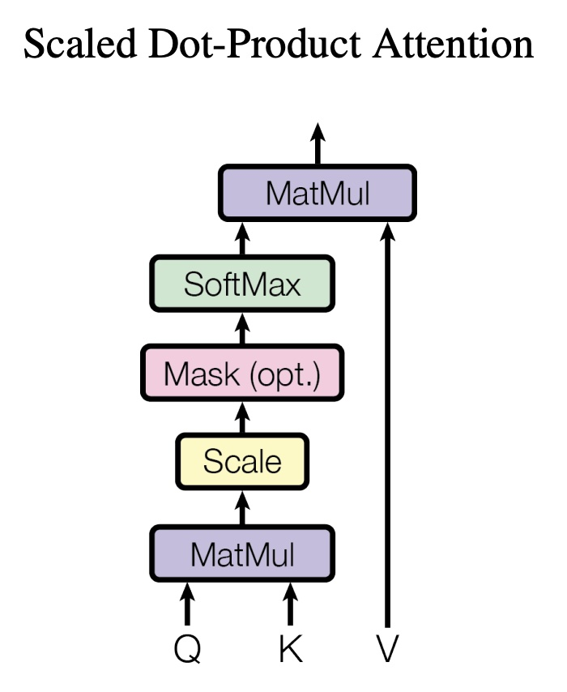

[key]{.key} [query]{.query} [value]{.value}

We navigate this world by paying attention. Every moment is filled with a sea of information around us, and to make _any_ decision we have to filter out most things, and focus on what's really important. What's important however is not necessarily the loudest, largest or closest thing. A subtle smell can alarm us of a nearby fire, a faint sound can tell us that a predator is approaching.

Reading a book is similar. At any given point, we understand what's happening because we know which previous parts were relevant and which ones weren't. 

Gandalf to Frodo:  
"*Many that live deserve death. And some that die deserve life. Can you give it to them?*"  

We know this is about Gollum and why Bilbo didn't stab him when he had the chance. We don't need to know about why Hobbits smoke a lot of weed or how old Gandalf is. Our brain automatically pays attention to the right things, and blends out the rest. We understand what's happening and have a feeling what could come next.

That's the function of the attention mechanism in Large Language Models (LLMs). Their input is a stream of words, one after the other. Stopping at any given word, the LLM has to ask: out of all the words before, which ones are really important to understand the _meaning_ of the current word and which ones are not? 

'Meaning' here isn't meant to be philosphical. It's simply defined by a goal: which words in the stream of language are most important to _predict_ the next word, given the current word? 

To give the current word meaning, attention integrates lots of previous words into the current word, but it does so in a way that gives more weight to important words and less weight to unimportant words. All this is done as part of a large neural network, so the attention mechanism only sets the stage, while training the network will actually determine what's important and what to blend out to produce the best language. 

On the journey to understand the intricacies of attention, we'll hopefully get some intuition about multiplying matrices, the softmax function, and why we normalise things.

## 1. Words to vectors

Neural networks can't process language directly, they need numbers. To create the actual input, we need two steps. 

In step one, our text is split up into tokens (think: words, but they could also be subwords). Each unique token gets a number. For example, the word 'think' might always get a 2342. If our training data has 174,423 unique tokens, we'll have 174,423 numbers.

```
--------------------------------------------------------------------------------
      I              think          therefore           I                am
      |               |                |                |                 |
      23             2342             234               1                 7 
--------------------------------------------------------------------------------
```

A simple number isn't very helpful in itself, we actual want a **vector** for each token. Why? Because vectors can represent the relationship between tokens really well, they can represent which tokens are more similar and which ones are different, for all the tokens we have.

These vectors are called [:embeddings](#x-embeddings). Here, each word embedding $x_i$ is a vector of length $d = 3$.

```
--------------------------------------------------------------------------------
      I              think          therefore           I                am
      |               |                |                |                 |
      23             2342             234               1                 7  
      |               |                |                |                 |
[0.1,0.3,0.2]    [0.2,0.1,0.3]    [0.3,0.2,0.1]    [0.1,0.3,0.2]    [0.2,0.1,0.3]
--------------------------------------------------------------------------------
```

## 2. Embeddings to keys, queries and values

<figure>
    
    <figcaption>Ricks</figcaption>
</figure>

Now into the nitty gritty of attention. Weirdly, attention doesn't operate on those "raw" embedding vectors directly. Instead, each $x$ gets three alter egos, called key, query and value. From the perspective of a token, this is what they represent:

1) My key is what I *have*
2) My query is what I'm *looking for*
3) My value is what I *communicate*

This is how they are made from the embedding vector $x$:
```{python}
import torch
d = 3 # dimensionality of the embedding vector
x_0 = torch.randn(1, d) # x_0 is a vector of size 1 x 3, e.g. the word 'I'

Wk = torch.randn(d, d) # Wk is a matrix of size 3 x 3
Wq = torch.randn(d, d) # Wq is a matrix of size 3 x 3
Wv = torch.randn(d, d) # Wv is a matrix of size 3 x 3

k_0 = x_0 @ Wk # k_0 is a vector of size 1 x 3
q_0 = x_0 @ Wq # q_0 is a vector of size 1 x 3
v_0 = x_0 @ Wv # v_0 is a vector of size 1 x 3
```


 Attention doesn't operate on the "raw" embedding vectors $x$ directly. Instead, it uses three representations of $x$, called _key_, _query_  and _value_. 

 attention uses keys, queries and values. Each key, query and value is just a linear projection of an embedding vector `x`. To get there, we simply multip

```{python}
import torch

x = torch.randn(1, 3)
x
```

These three representations are called _key_ (`k`), _query_ (`q`) and _value_ (`v`) and are vectors too. They can have the same dimensionality as `x`, but don't have to. 

Key, query and value are simple linear projections from `x`. We multiply `x` (1, C) with a weight matrix `Wk` (C, C) to get `k`, with `Wq` to get `q` and with `Wv` to get `v`. 

 simply matrix multiply the embedding vector $x$ (1, C) with three different weight matrices (C, C) $W_k$, $W_q$ and $W_v$. These are again just randomly initialised. 

This gives us three new random number vectors $k$, $q$ and $v$. We're here now with a bunch or random numbers. Keys queries and values are just projected randomness from random embeddings. This doesn't make sense yet, and things will only fall into place once everything is optimized through gradient descent.


```{python}
# Wk = torch.randn(C, C) # Wk is a matrix of size C x C
# Wq = torch.randn(C, C) # Wq is a matrix of size C x C
# Wv = torch.randn(C, C) # Wv is a matrix of size C x C

# k0 = X[0] @ Wk # k0 is a vector of size 1 x C
# q0 = X[0] @ Wq # q0 is a vector of size 1 x C
# v0 = X[0] @ Wv # v0 is a vector of size 1 x C
```

We start with a single embedding vector `x1`. `x1` gets projected into a `key`, `query` and `value` vector. 


```{python}
# x1 = X[0] # x1 is a vector of size 1 x C
# print(x1.shape)
# Wq = torch.rand(C, C) # Wq is a matrix of size C x C
# q0 = x1 @ Wq
# q0
```


For simplicity, we don't really care about the exact vectors here, so we initialise them randomly. We call the number of tokens in our input `T` for 'Time' as each token comes after the next and the number of dimensions in our embedding `C`, for Channels. That's just convention. To make attention efficient, these vectors are stacked on top of each other to form a matrix. Voila, we have our input. 

```{python}
# import torch

# T, C = 5, 3          # T = Time (#tokens), C = Channels (#dimensions)
# X = torch.rand(T, C) # X is our input, a matrix of size T x C
# print('Input matrix X, each row represents a token:')
# print(X)
```


## :x embeddings

How do we chose the numbers? Random at first, but when training the model, the vectors will change to represent meaningful relationships between tokens. Vectors representing tokens with similar meaning will be closer to each other in the multi-dimensional embedding space.

How long should the vectors be? That's a hyperparameter, so we chose. In the [Attention is all you need paper](https://arxiv.org/pdf/1706.03762.pdf), this parameter is called $d_{model}$ and is set to 512.


## other


[](attention.jpeg)

We create large language models to make sense of the world, like humans do. 

*Attention* powers modern transformer models, like ChatGTP. It doesn't look too complicated:

[](attention.jpeg)

Understanding attention is a bit like understanding how a child learns to speak. If your not an ML person, you'll also 
Our input is `x`, an embedding vector. Each token (a word or subword) gets translated into an embedding vector, simply a list of numbers. 

`I`  -> `[0.3, 0.2, 0.4, 0.3]`  
`am` -> `[0.1, 0.2, 0.3, 0.3]`

```{python}
import plotly.graph_objects as go

# Create nodes
nodes = go.Scatter(
    x=[1, 2, 2, 2],
    y=[2, 1, 2, 3],
    mode='markers+text',
    text=["X", "K", "Q", "V"],
    textposition='middle center',
    hoverinfo='text',
    hovertext=[
        None, 
        "K = XW<sub>k</sub>",
        "Q = XW<sub>q</sub>",
        "V = XW<sub>v</sub>"
    ]
)

# Create edges
edges = [
    go.layout.Shape(type="line", x0=1, y0=2, x1=2, y1=1, line=dict(color="black", width=2)),
    go.layout.Shape(type="line", x0=1, y0=2, x1=2, y1=2, line=dict(color="black", width=2)),
    go.layout.Shape(type="line", x0=1, y0=2, x1=2, y1=3, line=dict(color="black", width=2)),
]

layout = go.Layout(
    title="Graph",
    showlegend=False,
    shapes=edges,
    xaxis=dict(showgrid=False, zeroline=False, showticklabels=False),
    yaxis=dict(showgrid=False, zeroline=False, showticklabels=False),
)

fig = go.Figure(data=[nodes], layout=layout)

fig.show()

```

Attention is arguably the key piece of the [transformer architecture](https://arxiv.org/pdf/1706.03762.pdf) which powers large language models like GPT-4. It doesn't look too complicated at first. Just a few matrix multiplications and a softmax. For the un-initiated though, it's hard to grasp the essence of how attention actually works. 

$$\text{Attention}(Q, K, V) = \text{softmax}\left(\frac{QK^T}{\sqrt{d_k}}\right)V$$

For our Transformers reading group at the Alan Turing Institute, I recently signed up for a talk on attention. Most resources on attention are from the machine learning community, so I felt a lot of the explanations were lacking something, propably because I'm lacking intuition about neural networks (I'm a biologist/psychologist by training). However, there's a lot to learn. So let's go through, add some of the intuitions, and a few maths explainers to make sense of attention. Here's what I learned:

- why attention is so fundamental to the transformer architecture
- a bit of math (dot products, matrix multiplications, softmax)
- why one needs to think training a model when thinking about it's architecture

## The goal of attention

Finding relationships between words. For any given word, which other words are important to understand it? We will later see, that multi-head attention allows us to have many different understandings of this. Like a psychologist, a biologist, a physicist and a machine learning person thinking about the brain. 

