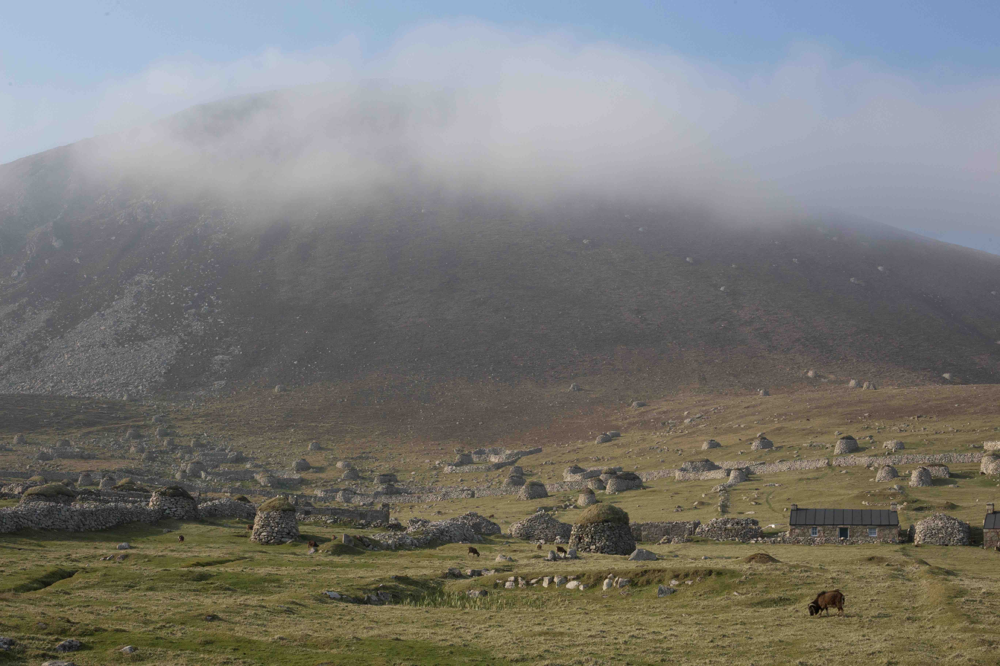
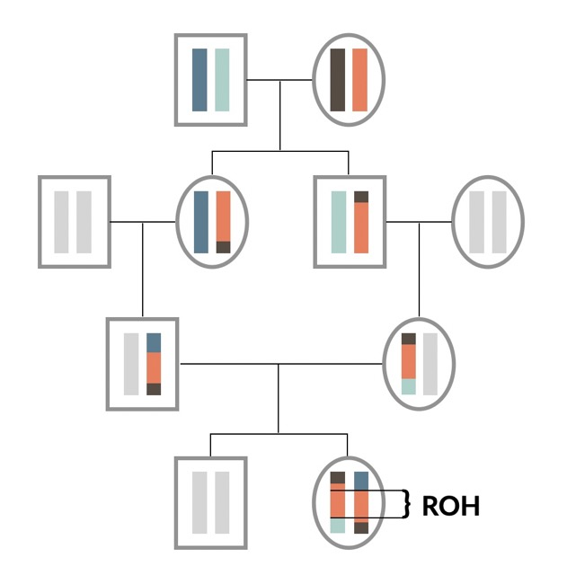
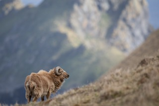
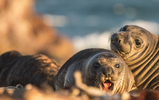
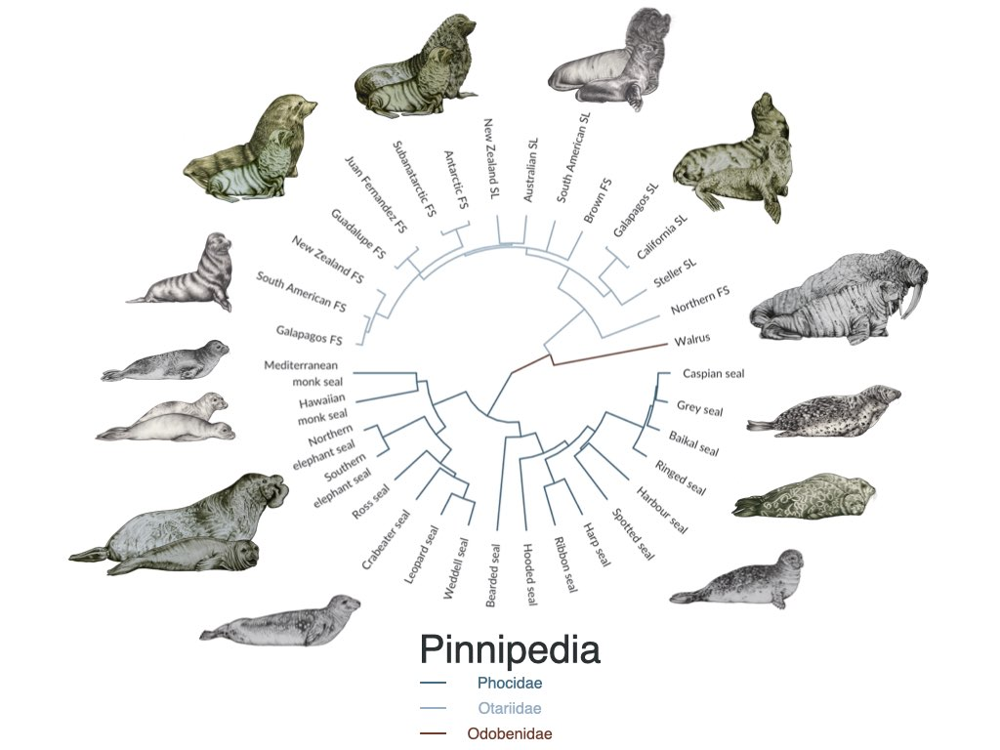
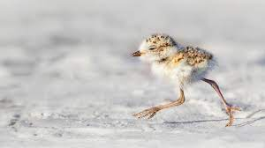
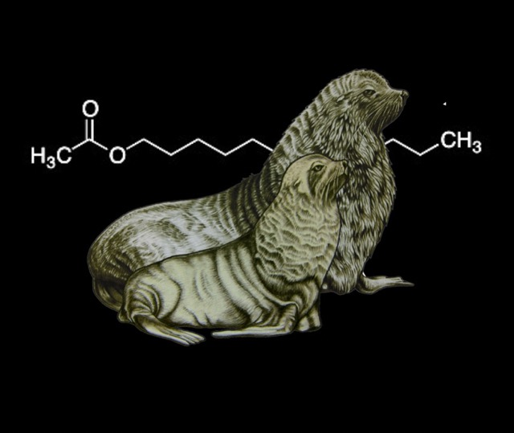

## Research

Selected papers with simplified titles. Thinking back, I should have probably chosen those titles in the first place. Full publication list [here](https://scholar.google.de/citations?user=58uLFHoAAAAJ&hl=en&oi=ao).

::: {layout="[25,85]"}

[Exploring lethal mutations and their evolutionary dynamics.](https://www.biorxiv.org/content/10.1101/2022.12.02.518882v1)\
*bioRxiv* (2022) \| [Code](https://github.com/mastoffel/haplotype_homozygosity)\
[:In a nutshell](#x-el)
:::

::: {layout="[25,85]"}

[Long runs of homozygosity have a higher mutation load because their haplotypes are younger](https://onlinelibrary.wiley.com/doi/full/10.1002/evl3.229).\
*Evol Letters* (2021) \| [Code](https://github.com/mastoffel/sheep_roh)\
[:In a nutshell](#x-roh)
:::

::: {layout="[25,85]"}

[Effect size and genetic basis of inbreeding depression in the wild](https://www.nature.com/articles/s41467-021-23222-9).\
*Nat Comms* (2021) \| [Code](https://github.com/mastoffel/sheep_ID)\
[:In a nutshell](#x-id), [:doubts](#x-id_doubts)
:::

::: {layout="[25,85]"}

[Early life gut microbiota predict extreme sex differences in Elephant Seals.](https://onlinelibrary.wiley.com/doi/full/10.1111/mec.15385)\
*Mol Ecol* (2020) \| [Code](https://github.com/mastoffel/nes_microbiome)\
[:In a nutshell](#x-nes), [:doubts](#x-nes_doubts)
:::

::: {layout="[25,85]"}

[Industrial exploitation brought one-third of pinniped species to the edge of extinction](https://www.nature.com/articles/s41467-018-06695-z).\
*Nat Comms* (2018) \| [Code](https://github.com/mastoffel/pinniped_bottlenecks)\
[:In a nutshell](#x-bot), [:doubts](#x-bot_doubts)
:::

::: {layout="[25,85]"}

[Biased sex ratios and the impact of early survival on female polygyny](https://www.pnas.org/doi/abs/10.1073/pnas.1620043114).\
*PNAS* (2017) \| Code in Supplementary Material\
[:In a nutshell](#x-plov)
:::

::: {layout="[25,85]"}

[Skin chemicals encode clues to identify offspring, home colony and potential mates in fur seals.](https://www.pnas.org/doi/abs/10.1073/pnas.1506076112)\
*PNAS* (2015) \| [Code](https://github.com/mastoffel/seal_chemical_fingerprints/blob/master/analysis_markdown.pdf) \| Article in the [Sueddeutsche Zeitung](https://www.sueddeutsche.de/wissen/biologie-wie-robben-einander-finden-1.2604289).\
[:In a nutshell](#x-chem), [:doubts](#x-chem_doubts)
:::

## Research consulting

::: {layout="[25,85]"}

[Impacts of inbreeding on racing in Thoroughbred horses.](https://royalsocietypublishing.org/doi/full/10.1098/rspb.2022.0487)  
*Proceedings of the Royal Society B* (2022)  
[:In a nutshell](#x-horse)
:::

## :x el{#x-el}
We scanned the Soay sheep population for embryonic lethal mutations, found a few, and explored patterns of purifying and balancing selection of them. The key take-away is that strongly deleterious mutations exist even in small populations. These mutations are unlikely to contribute much to the usual estimates of inbreeding depression, because they can cause mortality pre-birth. They can be quickly purged by purifying selection, but they can also be maintained by balancing selection in small population, when they are linked to a beneficial mutation.

*Authors* \| **MA Stoffel**, SE Johnston, JG Pilkington, JM Pemberton

## :x roh {#x-roh}

The fundamental question in this study was: Is the density of deleterious mutations in the genome higher in long runs of homozygosity (ROH)? If an individual inherits an ROH, this basically means that they inherited two copies the *very same* stretch of DNA (or haplotype) from both mum and dad. The longer such an ROH is, the fewer generations in thee past is it's most recent common ancestor haplotype. Therefore, natural selection had less time to remove potential deleterious mutations from this stretch of DNA.

Our simulations and empirical data for thousands of wild Soay sheep showed exactly this. Long ROH have a higher density of deleterious mutations, their frequencies are lower, and the harmful effect of each single mutation is on average higher than those of mutations in short ROH.

*Authors* \| **MA Stoffel**, SE Johnston, JG Pilkington, JM Pemberton

## :x id {#x-id}

We know that inbreeding is bad for offspring fitness since [Darwin](https://charles-darwin.classic-literature.co.uk/the-effects-of-cross-and-self-fertilisation/) or maybe even since [biblical times](https://en.wikipedia.org/wiki/Incest_in_the_Bible#:~:text=Incest%20in%20the%20Bible%20refers,21%2C%20but%20also%20in%20Deuteronomy.). The phenomenon is called **inbreeding depression** and is relevant not just for animals but also for [humans](https://www.nature.com/articles/s41467-019-12283-6). Studying a densely pheno- and genotyped wild population of bronze-age sheep, we show that the effects of inbreeding on survival are severe and uncover some of the underlying genetic mechanisms.

*Authors* \| **MA Stoffel**, SE Johnston, JG Pilkington, JM Pemberton

## :x id_doubts {#x-id_doubts}

The genetics of inbreeding depression is hard to study. Highly deleterious alleles are usually rare, making it statistically hard to pin them down. Moreover, the history of a population will have a large impact on the distribution of deleterious mutations. I'm currently uncertain about how many pieces of the puzzle we missed and how generalisable the patterns are.

## :x nes {#x-nes}

[:Northern elephant seals](https://en.wikipedia.org/wiki/Northern_elephant_seal) have the second-largest sexual size dimorphism of any mammal (right after their Southern sister-species). Adult males can be 3-5 times as heavy as females. Why is that? Sexual selection has favored larger males because they are able to defend large harems of females on the beach against competitors.

In young elephant seals (pups) you can't really spot a difference between males and females yet. However, when measuring their microbiome (the collection of bacteria in their guts) sampled with a very long cotton swab, we find very strong sex-differences from early on. This opens the possibility for microbes to provide an adaptation to these two very different life-histories of female and male elephant seals.

*Authors* \| **Martin A Stoffel**, Karina Acevedo‐Whitehouse, Nami Morales‐Durán, Stefanie Grosser, Nayden Chakarov, Oliver Krüger, Hazel J Nichols, Fernando R Elorriaga‐Verplancken, Joseph I Hoffman

## :x nes_doubts {#x-nes_doubts}

One of the most important aspects of this study is that we ruled out that sex-differences in the gut microbiome are simply to due differences in diet, as all pups only ever fed on their mother's milk and were fasting at the time of sampling. Therefore, it's likely that male and female pups have a different gut microbiome due to intrinsic causes (genetics, physiology). However, this doesn't mean that these differences are also adaptive and functional for things like development or the immune system.

## :x bot {#x-bot}

The scale of industrial seal hunting in the 18th-20th century was large, yet somehow overshadowed by the even larger whaling industry. Using genetics and a dataset of more than 11,000 seals, we estimate that many populations were on the edge of extinction. While only two species went extinct so far (the Carribean monk seal and the Japanese sea lion), others have lost most of their diversity.

*Authors* \| **MA Stoffel**, Emily Humble, AJ Paijmans, Karina Acevedo-Whitehouse, Barbara Louise Chilvers, B Dickerson, F Galimberti, Neil J Gemmell, SD Goldsworthy, HJ Nichols, Oliver Krüger, S Negro, A Osborne, T Pastor, Bruce Cameron Robertson, S Sanvito, JK Schultz, ABA Shafer, Jochen BW Wolf, Joseph I Hoffman

## :x bot_doubts {#x-bot_doubts}

To reconstruct the population histories of each species, we used **Approximate Bayesian Computation (ABC)**. The idea is simple: Simulate genetic data under a variety of population histories and use ABC to figure out what fits best to the empirical genetic data. However, the best model does not have to be *good*. Alternative, untested population histories could have explained the patterns equally well or better.

## :x plov {#x-plov}

Around 60% of adult snowy plovers are males, which led to a mating system where females are polygynous (they get to have more than one partner per season). My buddy Luke led this project, where we wanted to know where this sex biases comes from! Born 50/50, most of the sex biases we see in adults actually originates in juveniles, where males have lower survival rates than males. We therefore argue that two-sex population models (as used in our study) are essential to understand population dynamics and can help to shed light on some of the remaining mysteries around sexual selection.

*Authors* \| Luke J Eberhart-Phillips, Clemens Küpper, Tom EX Miller, Medardo Cruz-López, Kathryn H Maher, Natalie Dos Remedios, **Martin A Stoffel**, Joseph I Hoffman, Oliver Krüger, Tamás Székely

## :x chem {#x-chem}

Fur seal mothers have to find their own offspring in dense colonies among thousands of others when they return from their foraging trips at sea. Over distance, calls seem important but at close range sniffing is common. We showed that seal scent glands contain a mix of chemicals, which might be partially determined by genes and which make it possible to identify related individuals. To do this, we developed a new algorithm to work with gas-chromatography data from wild animals (`GCalignR`, see below) and borrowed analytical methods from psychology.

*Authors* \| **Martin A Stoffel**, Barbara A Caspers, Jaume Forcada, Athina Giannakara, Markus Baier, Luke Eberhart-Phillips, Caroline Müller, Joseph I Hoffman

## :x chem_doubts {#x-chem_doubts}

Skin chemicals co-vary with relatedness, genetic make-up and colony membership. This doesn't mean these 'signals' are recognised by individuals nor that they impact behaviour. Testing this specifically seems difficult in a wild population and requires syntesising these chemical signals and doing behavioural experiments. However, we know at least that sea lions can recognise their pups by [scent alone](https://royalsocietypublishing.org/doi/full/10.1098/rsbl.2010.0569?casa_token=dXG4dwFcjzAAAAAA%3AEVn-FEa6i8ojfD4e2zvZPc1EcV94Mykn8S_5mZXPKCSyR2BW5AV3iu5Pak5IY8iGwZWcZDm8SPPp4Q).

## :x horse {#x-horse}
We show that genomic inbreeding reduces the changes of a Thoroughbred horse ever making it to the racecourse, and pinpoint a genomic region where homozygosity has a particularly large effect, independent of genome-wide inbreeding.  

Emmeline W Hill, **Martin A Stoffel**, Beatrice A McGivney, David E MacHugh, Josephine M Pemberton

Pic by DALL-E.

